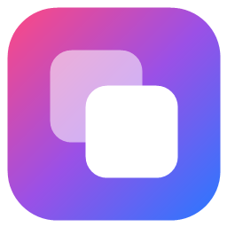

<p align="center">
  
</p>

<h1 align="center">ShortcutForge</h1>

<p align="center">Create and edit Apple Shortcuts on <b>Windows</b>.<br/>
<a href="README.hu.md">Magyar leírás</a></p>

---

ShortcutForge is a Windows desktop app for building shortcuts for Apple's Shortcuts app (iPhone, iPad, Mac). You can build them visually with action cards, much like in the Shortcuts app, or write them as code. You can also open existing `.shortcut` files, edit them and export signed files that import straight onto your devices.

## Features

- **Visual editor**: action cards like in the Shortcuts app. They support drag and drop, blocks (If / Otherwise, Repeat, Repeat with Each, Choose from Menu), a condition editor, collapsible cards, and undo / redo.
- **Variables like on the iPhone**: pick any action's output or a named variable. Get it as a type (`.as(Number)`), read a property (`.get("File Size")`) or a dictionary key (`["name"]`), and rename outputs.
- **Text view (DSL)**: the same shortcut as code, with syntax highlighting, completion (Ctrl+Space), folding and inline error markers. It stays in sync with the visual editor.
- **194 built-in actions** in categories. Any other action (including third-party App Intents) is kept and editable as a generic block, so nothing is lost when you import a shortcut.
- **Open / import**: signed and unsigned `.shortcut` files, binary and XML plists, iCloud share links.
- **Export**: `.shortcut` files, **signed for free online** (Shortcuty), on your own Mac over SSH, or by a signing server.
- **Templates** (*File › New from template*): greeting, JSON API call, quick menu, list processing, battery watcher, open-in-Reader share sheet action.
- **Light / dark theme** (follows Windows), **English / Hungarian** UI (*View* menu).

## Signing — important

Since iOS 15, iPhone, iPad and Mac only import shortcuts **signed by Apple**, and signing is only possible on macOS (`shortcuts sign`). ShortcutForge offers several ways around this:

1. **Free, online, no Mac: Shortcuty (recommended).** In *Tools › Settings* choose "Free online signing – Shortcuty". The app also offers this once, the first time you export. After that, *Export .shortcut* saves a signed file that you can import right away via AirDrop, iCloud Drive or email. It uses the public [Shortcuty signing API](https://github.com/Shortcuty/Signing-Server-API-Documentation) ("anyone" mode, no API key). The full shortcut is sent to Shortcuty's server, so do not sign shortcuts containing passwords, API keys or personal data this way.
2. **Free, on the iPhone:** *File › Export for iPhone* saves `Name.plist`. Open it on the phone with the free [Shortcut Source Helper](https://routinehub.co/shortcut/10060/) shortcut (RoutineHub), which signs it remotely and imports it. The app walks you through the steps.
3. **Your Mac over SSH:** enter a Mac (your own or a rented cloud Mac) in *Tools › Settings*, and the app signs on export automatically. This needs Remote Login enabled on the Mac, and iCloud sign-in for "anyone" mode.
4. **Signing server:** any [shortcut-signing-server](https://github.com/scaxyz/shortcut-signing-server) compatible URL, for example one running on your own Mac.

## The text language at a glance

```
#name "Good morning"
#icon color=blue glyph=59511

greeting = Text("Good morning, {ShortcutInput}!")
if greeting contains "morning" {
    Notification(greeting, title: "Hello")
} else {
    Alert("Not morning")
}
fruits = List(["apple", "pear"])
foreach fruits {
    ShowResult(RepeatItem)
}
action "com.example.app.SomeIntent" (Param: "value")

data = GetContentsOfUrl("https://example.com/api")
Alert(data.as(Dictionary)["name"])      // type + dictionary key
```

The full reference is in the app: *Help › Text language (DSL) help*, or F1.

## Download and run

Build from source (requires the [.NET 10 SDK](https://dotnet.microsoft.com/download)):

```
git clone https://github.com/kipergrof/ShortcutForge.git
cd ShortcutForge
dotnet run --project src/ShortcutForge.App
```

To make a single self-contained `.exe` that runs without .NET installed:

```
dotnet publish src/ShortcutForge.App -c Release -r win-x64 --self-contained -p:PublishSingleFile=true -o publish
```

## Project structure

| Project | Contents |
|---|---|
| `ShortcutForge.Core` | Model, lossless plist reading/writing, action catalog (`Catalog/Data/*.json`), import (signed AEA files, LZFSE, Apple Archive, iCloud), localization |
| `ShortcutForge.Dsl` | Lexer, parser and pretty-printer with verified lossless round trips |
| `ShortcutForge.Signing` | `ISigner`: unsigned export, Shortcuty, Mac over SSH, signing server |
| `ShortcutForge.App` | WPF app (MVVM, CommunityToolkit.Mvvm, AvalonEdit, Fluent theme) |
| `tests/*` | xUnit tests: plist and DSL round trips, LZFSE reference vectors, a real Apple-signed file, view models, signers |

```
dotnet test
```

**Adding an action:** add an entry to the matching `src/ShortcutForge.Core/Catalog/Data/*.json` file with its identifier, name, DSL name and parameters.

The version number is set in `Directory.Build.props`.

## Known limitations

- iCloud link import uses iCloud's unofficial web API.
- Icons are chosen by SF Symbol glyph number; the symbol itself is not previewed.
- Variable names written in the DSL (`x = …`) are not stored in the shortcut. When the shortcut is read back, names are derived from the output name (e.g. `text`).

## License

[MIT](LICENSE). Third-party notices: [THIRD-PARTY-NOTICES.md](THIRD-PARTY-NOTICES.md).

ShortcutForge is not affiliated with Apple. Apple, iPhone, iPad, Mac and Shortcuts are trademarks of Apple Inc.
